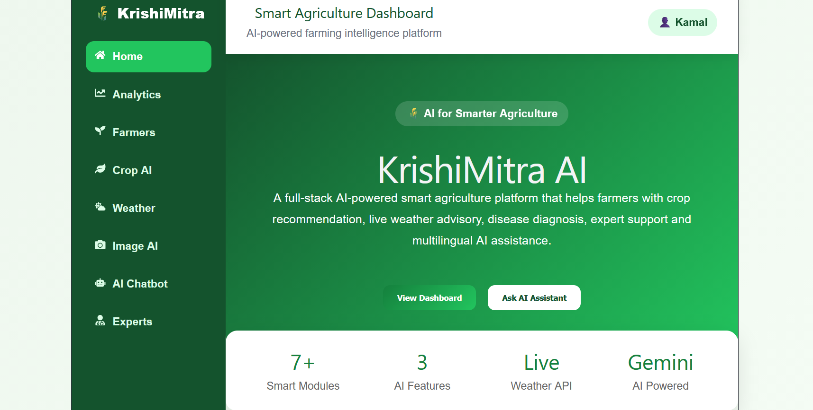
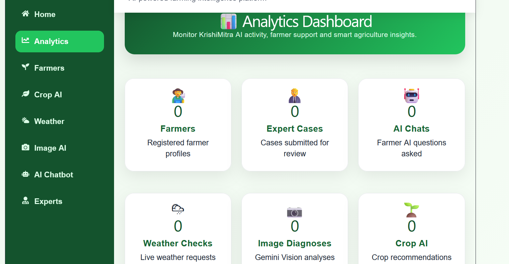
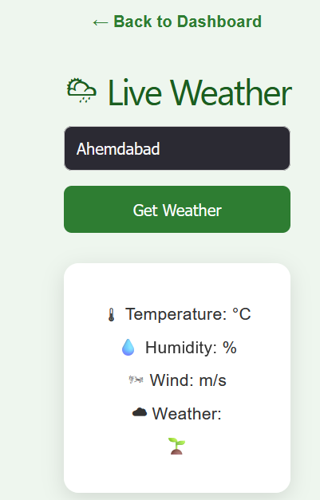
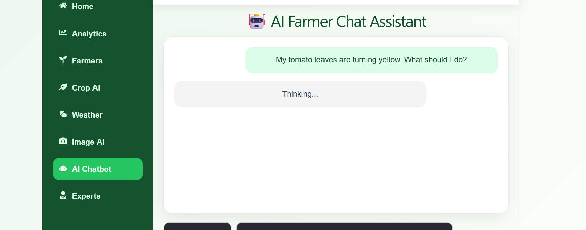
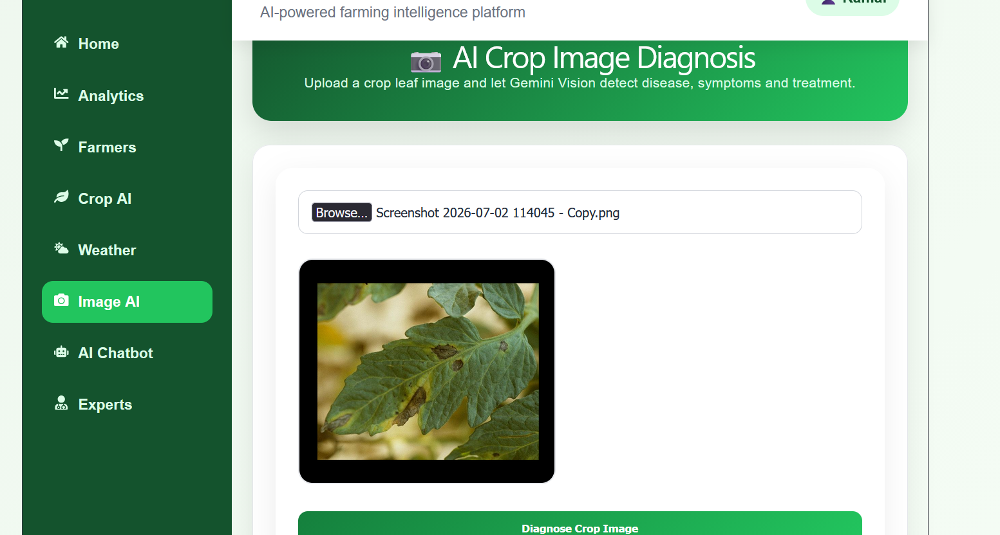
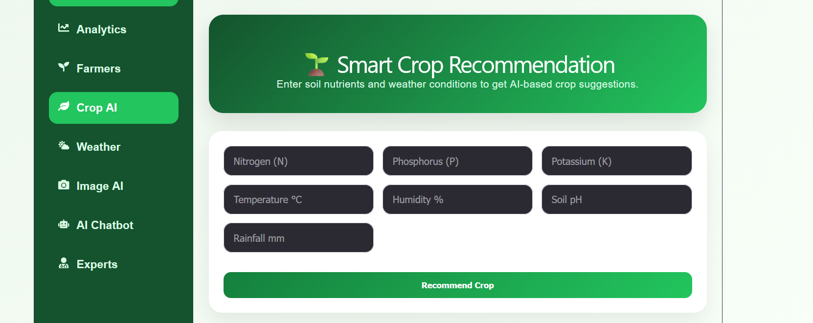
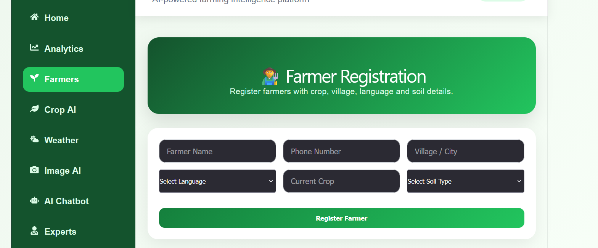
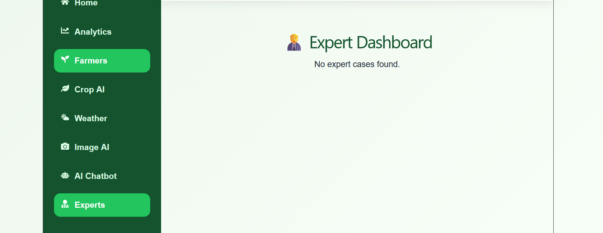

<div align="center">

# 🌾 KrishiMitra AI

### AI-Powered Smart Agriculture Platform for Farmers

Helping farmers with **Crop Recommendation**, **Disease Detection**, **Live Weather Advisory**, **AI Chatbot**, and **Expert Support** using Artificial Intelligence.


</div>

---

# 🌟 Overview

KrishiMitra AI is an intelligent agriculture platform that empowers farmers with AI-driven tools to improve crop productivity and make informed farming decisions.

The application combines:

- 🤖 Google Gemini AI
- 📷 AI Crop Disease Detection
- 🌱 Crop Recommendation System
- 🌦 Live Weather Advisory
- 💬 Multilingual AI Chatbot
- 👨‍🌾 Farmer Registration
- 👨‍⚕ Expert Dashboard
- 📊 Analytics Dashboard

---

# ✨ Features

## 👨‍🌾 Farmer Registration

- Register farmer details
- Store crop information
- Village & soil details
- Preferred language

---

## 🌱 Smart Crop Recommendation

AI recommends crops using

- Nitrogen
- Phosphorus
- Potassium
- Temperature
- Humidity
- Soil pH
- Rainfall

---

## 📷 AI Crop Disease Detection

Upload crop images and receive

- Disease Name
- Symptoms
- Treatment
- Prevention
- AI Diagnosis

Powered by **Google Gemini Vision**.

---

## 🌦 Live Weather Advisory

Real-time weather including

- Temperature
- Humidity
- Wind Speed
- Pressure
- Weather Description

with farming recommendations.

---

## 🤖 AI Farmer Chatbot

Ask farming questions in

- English
- Hindi
- Gujarati

Powered by **Google Gemini AI**.

---

## 👨‍⚕ Expert Dashboard

Experts can

- View submitted cases
- Review AI diagnosis
- Update case status

---

## 📊 Analytics Dashboard

Shows

- Registered Farmers
- Weather Requests
- AI Chats
- Crop Recommendations
- Image Diagnoses
- Expert Cases

---

# 📸 Application Preview

## 🏠 Home



---

## 📊 Dashboard



---

## 🌦 Weather



---

## 🤖 AI Chatbot



---

## 📷 Disease Detection



---

## 🌱 Crop Recommendation



---

## 👨‍🌾 Farmer Registration



---

## 👨‍⚕ Expert Dashboard



---

# 🏗 System Architecture

```text
                React Frontend
                       │
                       ▼
                FastAPI Backend
                       │
      ┌────────────────┼────────────────┐
      │                │                │
      ▼                ▼                ▼
 Gemini AI      OpenWeather API     MongoDB Atlas
```

---

# 🛠 Technology Stack

## Frontend

- React
- Vite
- React Router
- React Icons
- Recharts

## Backend

- Python
- FastAPI

## AI

- Google Gemini AI
- Gemini Vision

## Database

- MongoDB Atlas

## APIs

- OpenWeather API

---

# 📂 Project Structure

```text
KrishiMitra-AI

backend/
│
├── services/
├── uploads/
├── data/
├── database.py
├── main.py
└── requirements.txt

frontend/
│
├── public/
├── src/
│   ├── components/
│   ├── pages/
│   ├── services/
│   ├── App.jsx
│   └── App.css

assets/
└── screenshots/

README.md
```

---

# 🚀 Installation

## Clone Repository

```bash
git clone https://github.com/Im-Kamall/KrishiMitra-AI.git

cd KrishiMitra-AI
```

---

## Backend

```bash
cd backend

python -m venv venv

venv\Scripts\activate

pip install -r requirements.txt

python -m uvicorn main:app --reload
```

Backend

```
http://127.0.0.1:8000
```

Swagger

```
http://127.0.0.1:8000/docs
```

---

## Frontend

```bash
cd frontend

npm install

npm run dev
```

Frontend

```
http://localhost:5173
```

---

# 🔑 Environment Variables

Create

```
backend/.env
```

```env
MONGODB_PASSWORD=YOUR_PASSWORD

GEMINI_API_KEY=YOUR_GEMINI_API_KEY

OPENWEATHER_API_KEY=YOUR_OPENWEATHER_API_KEY
```

---

# 🔌 API Endpoints

| Method | Endpoint | Description |
|---------|----------|-------------|
| GET | / | Home |
| GET | /health | Health Check |
| GET | /analytics | Analytics |
| POST | /register-farmer | Register Farmer |
| GET | /farmers | List Farmers |
| POST | /recommend-crop | Crop Recommendation |
| POST | /live-weather | Live Weather |
| POST | /crop-image-diagnosis | Crop Disease Detection |
| POST | /ask-ai | AI Chatbot |
| GET | /expert-cases | Expert Cases |

---

# 🚀 Future Enhancements

- 🎤 Voice Assistant
- 📱 Mobile Application
- 🌍 Multi-language UI
- 📡 IoT Sensor Integration
- 🚁 Drone Image Analysis
- 🔔 Push Notifications
- 📈 Advanced Analytics

---

# 👨‍💻 Developer

**Kamal Solanki**

Computer Science Engineering Student

Aspiring Data Scientist • Machine Learning Engineer • AI Engineer

### GitHub

https://github.com/Im-Kamall

### LinkedIn

(Add your LinkedIn Profile)

---

# ⭐ Support

If you like this project:

⭐ Star this repository

🍴 Fork it

🤝 Contribute

---

# 📜 License

MIT License

---

<div align="center">

Made with ❤️ using Python, FastAPI, React & Google Gemini AI

</div>